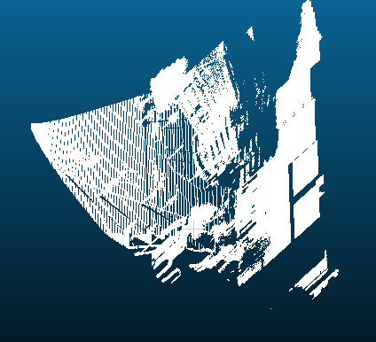

# 3D Point Cloud

Proyecto educativo para generar y procesar nubes de puntos 3D a partir de imágenes de profundidad sintéticas producidas por el simulador [CARLA](https://carla.org/). El objetivo es optimizar el pipeline de reconstrucción 3D para que pueda ejecutarse en computadoras de bajo rendimiento.



## Estructura del proyecto

```
.
├── script/
│   └── generate_data.py 
├── src/
│   ├── main.py
│   └── utils.py
├── output/
├── requirements.txt
└── readme.md
```


## Configuración de la cámara (CARLA)

Los parámetros por defecto en `generate_data.py` son:

| Parámetro | Valor |
|---|---|
| Resolución | 1280 × 720 |
| FOV | 90° |
| Posición (x, y, z) | 1.5, 0.0, 2.0 m |
| Vehículo | Tesla Model 3 |
| Frames máximos | 10 000 |
